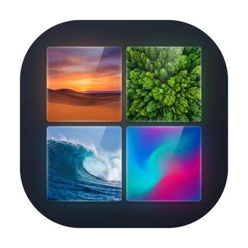

<div align="center">

  

  <h1>Wallpaper Selector</h1>

  <p><b>Your wallpapers. Fast, native, and out of the way.</b></p>

  <p>
    A native macOS menu-bar app for picking, rotating, and organizing local wallpapers.<br/>
    No Electron. No network. Your wallpaper folders stay on your Mac.
  </p>

  <p>
    <a href="https://github.com/wiggly-sheets/wallpaper-selector/actions"></a>
    <a href="https://github.com/wiggly-sheets/wallpaper-selector/releases/latest"></a>
  </p>

  <p>
    <a href="https://github.com/wiggly-sheets/wallpaper-selector/releases/latest"><b>Download</b></a>
    &nbsp;·&nbsp;
    <a href="#installation">Install guide</a>
    &nbsp;·&nbsp;
    <a href="#build-from-source">Build from source</a>
    &nbsp;·&nbsp;
    <a href="#privacy">Privacy</a>
  </p>

</div>

---

Wallpaper Selector lives in your menu bar. Choose folders of images, set one
now, rotate them on a schedule, organize subsets into themes, and let light
and dark appearance choose different wallpapers.

## Features

- Menu-bar controls for picker, preview, shuffle, next/previous, rotation,
  themes, recents, appearance matching, and settings
- Native picker with thumbnail grid, natural filename sorting, current-image
  checkmark, folders, and themes
- Compact vibrancy preview window anchored below menu-bar icon
- Rotation: 30 minutes, hourly, 12 hours, daily; shuffle, sequential, and
  theme rotation modes
- Light/dark theme and wallpaper pins, with automatic appearance switching
- Configurable global shortcuts and launch at login
- JSON settings, recent-wallpaper history, and direct external-settings sync
- Every connected display receives wallpaper updates
- Optional All Spaces automation through macOS Wallpaper settings

## Installation

### Homebrew

Homebrew cask publishing is being prepared. After first public release:

```bash
brew install --cask wiggly-sheets/tap/wallpaper-selector
```

### Manual install

1. Download latest `.dmg` from [Releases](https://github.com/wiggly-sheets/wallpaper-selector/releases/latest).
2. Open it and drag **Wallpaper Selector** to Applications.
3. Launch app. On first run, choose one or more wallpaper folders.

### First open and quarantine

Current releases are ad-hoc signed and not notarized. macOS may show a
quarantine warning on first open. Only bypass it for a DMG downloaded from the
[official releases page](https://github.com/wiggly-sheets/wallpaper-selector/releases/latest).

**Finder UI:** Open Applications, Control-click **Wallpaper Selector**, choose
**Open**, then choose **Open** again in macOS confirmation dialog.

**Terminal:** Remove quarantine from this app only, then launch it:

```bash
xattr -dr com.apple.quarantine "/Applications/Wallpaper Selector.app"
open "/Applications/Wallpaper Selector.app"
```

### All Spaces permission

macOS has no public API for its **Show on all Spaces** wallpaper preference.
When you enable All Spaces, Wallpaper Selector opens System Settings and asks
for Accessibility permission. Grant it in **System Settings → Privacy &
Security → Accessibility**; app then turns on macOS preference and closes
System Settings.

## Build from source

Requirements:

- macOS 13 or newer
- Xcode 15 or newer

```bash
git clone https://github.com/wiggly-sheets/wallpaper-selector.git
cd wallpaper-selector
make test
make run
```

Useful commands:

```bash
make bundle                       # dist/Wallpaper Selector.app
make install                      # ~/Applications/Wallpaper Selector.app
make release-artifacts VERSION=1.0.0
```

`make release-artifacts` creates a versioned DMG and `.sha256` checksum under
`release/`.

## Privacy

Wallpaper Selector runs locally. Folder paths, themes, shortcuts, and history
stay in `~/Library/Application Support/WallpaperSelector/settings.json` unless
you choose a different settings folder. It does not upload images, settings,
or usage data.

## Releases and Homebrew

Pushing tag `vX.Y.Z` runs release workflow, builds DMG plus SHA-256 checksum,
and publishes GitHub release. Cask template and publish notes live in
[Homebrew](Homebrew/README.md).
